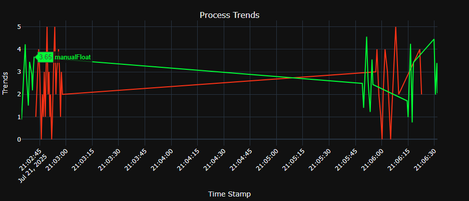

# Trend Plotter for Siemens Data Trends
## Installation - Windows Only
Download the latest [release](https://github.com/I-Haehnlein/trendLoader/releases) and run installer to add program to system applications.

## Usage
1. Select file type: "Auto Export" or "Siemens Trend Export"
    - This refers to how the file was exported on the system.
2. Click "Select Trend File" and navigate to the location of your data, selecting the plot you wish to look at.
3. The "Unified Marker Display" is an option for how the data popup is shown on cursor hover.
    - With this checked, all lines on a subplot will be displayed for the given time value the cursor is hover over.
    - Without this checked, the line and timestamp closest to the cursor position will be displayed.
    - See section below for example of cursor hover types.
4. Click "Plot Data"
    - This should open up an interactive plot in your default browser.
5. Optional:
    - Save Interactive will save the plot with its data in an interactive html format that can be opened on any machine via a web browser.
    - Save PNG will save a static image. Amodified static image can also be saved on the interactive plot after visible lines or zoom have been adjusted.

### With Unified Marker Option

### Without Unified Marker Option

### Working With the Interactive Plot
These plots are built using the backend of Plotly in python. Please see plotly documentation for directions on interacting with the plots.

- Zoom - Select Zoom icon in the upper right corner of the screen. Menu should appear when hovering over the plot area.
    - Clicking and dragged on the plot are will allow you to zoom to a windowed selection.
    - Dragging directly horizontal will only zoom in the time domain
    - Dragging directly vertical will only zoom in the value domain
    - Return to original view by either double-clicking in the plot area, or selecting the "Reset Axes" button in the plot menu (home symbol)
    - Note the time axis for each subplot is linked. Zooming in the time axis on 1 plot will zoom on the other subplot.
- Pan - Select the Pan icon in plot menu (next to zoom)
    - This allows you to click and drag the plot area at the curent zoom window.
- Isolating or Hiding a Trend Line
    - You can hide or unhide a trendline by clicking on it's name in the legend. This allows you to tailor you view to isolate the issue at hand.
    - If you need to isolate a trend line, double-click on the trend name in the legend. This will hide all lines except the selected one.
        - From here you can single-click on any trend line to enable it from there.